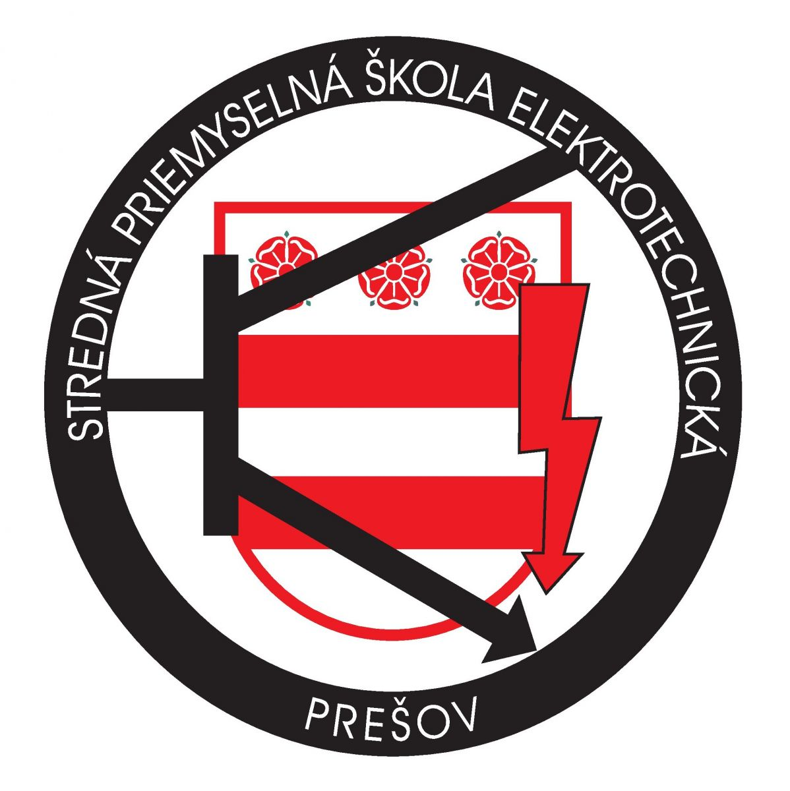

# EntryApplication SPSE-PO

## O projekte
Android aplikácia bola vytvorená pre súkromný školský internát pri Strednej elektrotechnickej škole v Prešove na ulici Plzenská 1. 
Aplikácia slúži na zaznamenávanie príchodov a odchodov študentov ubytovaných v budove internátu. Správa aplikácie je zabezpečená 
prostredníctvom informačného portálu dostupného na adrese : http://entryappspse.6f.sk/ .

